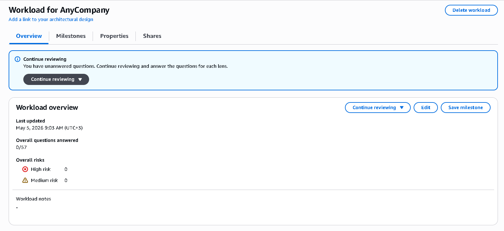

# ☁️ AWS Cloud Architecture Labs

## 📋 Table of Contents

- [Overview](#overview)
- [Lab 1 — AWS Well-Architected Tool](#lab-1--aws-well-architected-tool)
  - [What We Did](#what-we-did)
  - [Key Concepts & Best Practices](#key-concepts--best-practices)
- [Lab 2 — Highly Available Web Application](#lab-2--highly-available-web-application)
  - [Architecture Overview](#architecture-overview)
  - [What We Built](#what-we-built)
  - [Chaos Engineering with AWS FIS](#chaos-engineering-with-aws-fis)
  - [Key Concepts & Best Practices](#key-concepts--best-practices-1)
- [Lessons Learned & Real-World Guidance](#lessons-learned--real-world-guidance)

---

## Overview

This repository documents two completed AWS hands-on labs covering cloud architecture review methodology and the end-to-end construction of a production-grade, highly available web application. Both labs were completed in a provisioned AWS environment targeting the role of a **Solutions Architect**.

The first lab establishes the practice of evaluating architectures using the **AWS Well-Architected Framework**. The second lab puts that framework into action by building a real, multi-AZ WordPress deployment using Aurora, ElastiCache, EFS, an Application Load Balancer, and Auto Scaling — then stress-testing it with the **AWS Fault Injection Simulator**.

---

## Lab 1 — AWS Well-Architected Tool

### What We Did

#### 1.1 — Workload Creation

A workload named **"Workload for AnyCompany"** was defined in the AWS Well-Architected Tool, targeting a **Pre-production** environment in the lab's assigned region. The Well-Architected Framework lens was applied automatically.



---

#### 1.2 — Architecture Review

The review was conducted across the six pillars of the Well-Architected Framework:

| Pillar | Focus |
|---|---|
| Operational Excellence | How priorities, ownership, and processes are structured |
| Security | Protection of systems and data |
| Reliability | Recovery from failures, scaling dynamically |
| Performance Efficiency | Efficient use of compute resources |
| Cost Optimization | Avoiding unnecessary costs |
| Sustainability | Minimising environmental impact |

For **OPS 1** (priority determination), the following criteria were confirmed as met:
- ✅ Evaluate external customer needs
- ✅ Evaluate internal customer needs
- ✅ Evaluate threat landscape
- ✅ Evaluate tradeoffs while managing benefits and risks
- ⚠️ Evaluate governance requirements *(InfoSec review pending)*
- ⚠️ Evaluate compliance requirements *(InfoSec review pending)*

For **OPS 2** (organizational structure), the confirmed criteria were:
- ✅ Resources have identified owners
- ✅ Processes and procedures have identified owners
- ✅ Operations activities have identified owners
- ✅ Responsibilities between teams are predefined or negotiated

The tool flagged **2 High Risk items** from the omitted answers — governance and compliance gaps — and surfaced them with recommended improvement links directly into the Well-Architected Framework documentation.


---

#### 1.3 — Milestone Saved

A milestone named **"AnyCompany Application - First Draft"** was saved to record the state of the workload at this point in time. The milestone captures:
- Number of questions answered
- Number of high and medium risks
- Date the snapshot was taken


---

#### 1.4 — Pillar Priority & Milestone Report

The pillar priority was adjusted to place **Security at the top**, reflecting AnyCompany's requirement for multi-layered security. Improvement status was set to **Not Started**. A milestone report was generated containing all responses, notes, and identified risks — ready to share with team members who lack direct tool access.


---

### Key Concepts & Best Practices

> **Why we did it this way (lab constraints):** We only answered two questions before saving the milestone because the lab scope was limited. In a real review, the milestone would be saved only after completing all six pillars.

**For your own future workloads:**

- ✅ **Complete all pillars before the first milestone.** The first production milestone should reflect a full baseline review — all questions answered, all pillars evaluated. Partial reviews make risk comparisons across milestones unreliable.
- ✅ **Save a milestone after every significant improvement.** Each time you address a high or medium risk, save a new milestone so progress is documented and comparable over time.
- ✅ **Adjust pillar priority per workload type.** A fintech app should prioritize Security and Reliability. A batch analytics workload may prioritize Cost Optimization and Performance Efficiency. The tool supports this natively.
- ✅ **Use the report to drive stakeholder conversations.** The generated PDF/HTML report is the right artifact to bring to architecture review boards, compliance teams, or leadership — it communicates risk quantitatively.
- ✅ **Re-review on a cadence.** The Well-Architected Tool is not a one-time exercise. High-growth products should be reviewed every 6–12 months or after major architecture changes.
- ✅ **Integrate InfoSec and Compliance teams early.** The high risks flagged in this lab (governance and compliance gaps) are exactly the kind of gaps that cause audit failures in production. Block their feedback into the first milestone before any workload goes live.

---

## Lab 2 — Highly Available Web Application

### Architecture Overview

A full-stack WordPress application was deployed across **two Availability Zones** inside a custom VPC, using the following layered architecture:

```
Internet
    │
    ▼
Internet Gateway
    │
    ▼
Application Load Balancer (Public Subnets — AZ-a, AZ-b)
    │
    ▼
Auto Scaling Group — EC2 App Servers (App Subnets — AZ-a, AZ-b)
    │           │
    ▼           ▼
Amazon EFS   Amazon ElastiCache (Memcached) ── Amazon Aurora (Multi-AZ)
(Shared NFS)     (Caching Layer)                (Writer + Reader)
```


---

### What We Built

#### 2.1 — Network Layer (CloudFormation)

The VPC and all subnet/NAT gateway resources were provisioned using a pre-supplied **CloudFormation template** (`Task1StackPublic`). Two Availability Zones were used, each with a public subnet, an app subnet, and a database subnet. NAT Gateways in each public subnet allow the app servers to reach the internet for updates without being publicly reachable themselves.

> **Why CloudFormation?** Infrastructure-as-Code ensures the network is reproducible, version-controlled, and auditable. Manually clicking through VPC creation is error-prone and leaves no deployment record.


---

#### 2.2 — Amazon Aurora (Multi-AZ RDS)

An **Aurora MySQL** DB cluster named `mydbcluster` was created with the following configuration:

| Setting | Value |
|---|---|
| Engine | Aurora (MySQL Compatible) |
| Template | Production |
| Multi-AZ | Aurora Replica in a second AZ |
| Subnet Group | `labdbsubnetgroup` (private DB subnets) |
| Public Access | No |
| Initial DB Name | `WPDatabase` |
| Encryption | Disabled *(lab constraint)* |

The Writer endpoint was captured and passed downstream to the WordPress configuration.


> **Why we disabled encryption (lab only):** Encryption was turned off to reduce provisioning time and avoid CMK management complexity in the lab environment.
>
> **Best practice for your own workloads:** Always enable encryption at rest (AES-256 via AWS KMS) for any RDS/Aurora instance handling real data. Enable auto minor version upgrades and deletion protection in production — we disabled both here due to lab cleanup requirements.

---

#### 2.3 — Amazon ElastiCache (Memcached)

An ElastiCache **Memcached** cluster named `MyWPCache` was deployed with 2 nodes (`cache.t3.micro`) across the private cache subnets. It acts as a read-through cache in front of Aurora, absorbing repeated database queries and reducing latency for end users.


> **Lab vs. best practice:** We used Memcached rather than Redis. **For your own workloads**, prefer **ElastiCache for Redis** if you need persistence, replication, pub/sub, or sorted sets. Memcached is simpler and marginally faster for pure object caching with no need for data recovery.

---

#### 2.4 — Amazon EFS (Shared NFS Storage)

An EFS file system named `myWPEFS` was created and mounted to **AppSubnet1** and **AppSubnet2** via NFS mount targets, one per AZ. This gives all EC2 app servers in the Auto Scaling group a shared, consistent view of the WordPress `wp-content` directory (uploads, themes, plugins).

| Setting | Value |
|---|---|
| Automatic backups | Disabled *(lab constraint)* |
| Mount target AZ-a | AppSubnet1 |
| Mount target AZ-b | AppSubnet2 |
| Security Group | `EFSMountTargetSecurityGroup` |


> **Why EFS instead of instance storage?** Without shared storage, each EC2 instance in an Auto Scaling group would have its own isolated copy of uploaded files. EFS solves this by presenting a single NFS endpoint that all instances mount — uploads made to one instance are immediately visible to all others.
>
> **Best practice for your own workloads:** Enable EFS automatic backups in production. Consider EFS Intelligent-Tiering to automatically move infrequently accessed files to a lower-cost storage class.

---

#### 2.5 — Application Load Balancer

An **Application Load Balancer** named `myWPAppALB` was created across both public subnets, routing HTTP:80 traffic to the target group `myWPTargetGroup`. Health checks were configured to probe `/wp-login.php`, with a 2-check healthy threshold and 10-check unhealthy threshold, allowing the ASG time to initialise WordPress before being marked healthy.


---

#### 2.6 — Launch Template & Auto Scaling Group (CloudFormation)

A second CloudFormation stack (`WPLaunchConfigStack`) was deployed to create the EC2 **Launch Template**, embedding the WordPress user data, EFS mount configuration, Aurora connection strings, and Memcached endpoint. The Auto Scaling group `WP-ASG` was then configured:

| Setting | Value |
|---|---|
| Desired capacity | 2 |
| Minimum capacity | 2 |
| Maximum capacity | 4 |
| Subnets | AppSubnet1, AppSubnet2 |
| Scaling policy | Target tracking |
| Load balancer health checks | Enabled |
| CloudWatch group metrics | Enabled |

Both instances launched in the `InService` state and the target group showed **Healthy** status within ~5 minutes.


---

### Chaos Engineering with AWS FIS

#### The Experiment

An **AWS Fault Injection Simulator** experiment template named `TerminateInstancesinAZ` was created to simulate an Availability Zone outage. The experiment targeted all running EC2 instances tagged `wp-ha-app` in `{LabRegion}a` and terminated them simultaneously.

**Assumption being tested:**
> *If AZ-a suffers a complete outage and all EC2 instances in that AZ are terminated, the WordPress application remains available — the ALB reroutes traffic to AZ-b and the ASG launches replacement instances to restore desired capacity.*


#### Results

- ✅ The WordPress site remained accessible throughout the experiment — the ALB immediately routed all traffic to the surviving AZ-b instance.
- ✅ The Auto Scaling group detected the unhealthy/missing instances and launched replacements within minutes.
- ✅ Desired capacity of 2 was restored automatically, across both AZs.


> **Why FIS instead of manually stopping instances?** Manual termination is not reproducible, not schedulable, and cannot be applied at scale. FIS lets you define, version, and repeat chaos experiments with IAM-controlled blast radius and configurable stop conditions. This is the foundation of a mature **chaos engineering** practice.

---

### Key Concepts & Best Practices

> **Why we did it this way (lab constraints vs. real world):**

| What we did in the lab | Best practice for your own workloads |
|---|---|
| Disabled Aurora encryption | Always enable KMS encryption at rest |
| Disabled auto minor version upgrade | Enable it — patches are applied during your maintenance window |
| Disabled deletion protection | Enable it — prevents accidental cluster deletion |
| Used Memcached | Use Redis if you need replication or persistence |
| HTTP only on ALB | Add an HTTPS listener with ACM certificate; redirect HTTP → HTTPS |
| Disabled EFS automatic backups | Enable AWS Backup for EFS in production |
| No CloudFront (base lab) | Add CloudFront as a CDN layer to reduce ALB origin load and improve global latency |
| Single FIS action (terminate) | Combine actions: inject CPU stress, throttle network, terminate — layered chaos gives richer signal |
| No stop conditions on FIS | Always configure a CloudWatch alarm stop condition (e.g. stop if error rate > 5%) |

**Additional architecture best practices for your future HA workloads:**

- ✅ **Use at least 3 AZs** in regions that support it. Two AZs tolerate one AZ failure; three AZs tolerate one AZ failure while still maintaining redundancy in the remainder.
- ✅ **Place databases in private subnets only.** Never expose RDS/Aurora to the public internet.
- ✅ **Decouple storage from compute with EFS or S3.** Stateful EC2 instances cannot scale horizontally without shared storage.
- ✅ **Set ALB access logging to S3.** Every request hitting the load balancer should be logged for forensics, debugging, and cost attribution.
- ✅ **Tag everything.** The `Name: wp-ha-app` tag was critical for the FIS target filter. Consistent tagging enables cost allocation, automation targeting, and security policy scoping.
- ✅ **Use CloudWatch Composite Alarms.** A single metric alarm is noisy. Composite alarms combine multiple signals (CPU + error rate + healthy host count) into a single actionable alert.

---

## Lessons Learned & Real-World Guidance

| Theme | Takeaway |
|---|---|
| **Architecture review is continuous** | The Well-Architected Tool is a living document. A first-draft milestone is a starting point, not a sign-off. |
| **Shared storage is non-negotiable for stateful apps at scale** | EFS allowed horizontal EC2 scaling without data divergence. S3 is the equivalent for object-heavy workloads. |
| **Caching reduces blast radius** | ElastiCache absorbed read traffic so Aurora was not the single point of failure for every page load. |
| **Chaos before production, not after** | FIS proved the architecture works under failure. Running this test after launch would mean users are the ones discovering the failure mode. |
| **IaC from day one** | Both the network and the launch template were deployed via CloudFormation. Manual console clicks cannot be reproduced reliably. Use CloudFormation, CDK, or Terraform from the very first resource. |
| **High availability is a design choice, not a feature you add later** | Multi-AZ Aurora, multi-subnet ASG, and cross-AZ ALB had to be configured at creation time. Retrofitting HA onto a single-AZ architecture is expensive and risky. |

---

> **Completed Labs:**
> 1. Walkthrough of the AWS Well-Architected Tool — `SPL-CX-100-CEAWAT-1`
> 2. Building a Highly Available Web Application — `SPL-CX-200-CPHAWA-1`

*All infrastructure was provisioned in a sandboxed AWS account and has since been decommissioned.*
